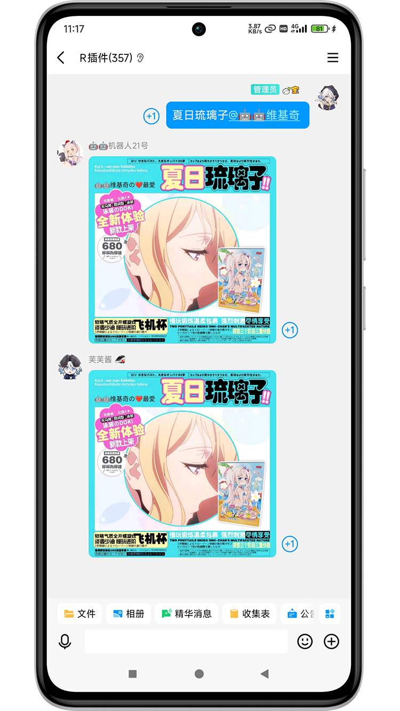

# meme_emoji_rust_alpha 

  
  
  
  

> [!CAUTION]
> `meme_emoji_rust_alpha` 仓库目前处于 **Alpha（α）阶段**，这意味着它仍在**早期开发**中，可能存在不稳定或未完成的功能。
>
> 以下是使用时需要注意的事项：
>
> ### **1. 功能可能不完整**
>
> - 该版本的功能仍在开发中，部分 表情包 或 可能会**频繁变动**。
> - **不建议在生产环境使用**，仅适用于测试。
>
> ### **2. 可能存在 Bug 或崩溃**
>
> - Alpha 版本通常**未经充分测试**和**修复**，可能会遇到运行时错误或意外行为。
> - 如果发现 Bug，请自行解决。
>
> ### **3. keywords 可能随时变更，仅在NoneBot和**meme-generator**命令行环境下测试
>
> - 代码结构、变量命名或接口可能在后续版本中**不兼容调整**，仅在**NoneBot**和**meme-generator**环境下测试.
> - 如果喜欢此仓库，请锁定Python版本[meme_emoji](https://github.com/anyliew/meme_emoji)使用。
>
> ### **4. 目前关闭反馈，只接受PR**
>
> - 如果你有兴趣改进项目，可以： **提交 PR**（Pull Request）修复问题。

## 表情包扩展仓库 meme_emoji_rust_alpha

😊是[meme_emoji](https://github.com/anyliew/meme_emoji) 在[meme-generator-rs](https://github.com/MemeCrafters/meme-generator-rs) 的延伸，同步的[meme_emoji](https://github.com/anyliew/meme_emoji) 仓库表情素材于此

🚀 基于 [meme-generator-rs](https://github.com/MemeCrafters/meme-generator-rs) 做的扩展表情包仓库

*✨* 为你的聊天机器人添加更多趣味表情生成！

## 特性

- ✅ **海量表情** 偶尔做做热门表情包，也欢迎投稿高清有趣的素材
- ⚡ **实时生成** 支持通过指令快速生成表情
- 🔄 **搭配使用** 需要搭配 [meme-generator-rs](https://github.com/MemeCrafters/meme-generator-rs) 一起使用

## 已实现表情示例
### 参考预览图：

## 相关链接

- [meme_emoji](https://github.com/anyliew/meme_emoji)
- [meme-generator-rs](https://github.com/MemeCrafters/meme-generator-rs) 
- meme-generator-contrib-rs 额外表情仓库[MemeCrafters/meme-generator-contrib-rs](https://github.com/MemeCrafters/meme-generator-contrib-rs) 

## 反馈
目前不接受反馈，有能力请 **PR**（Pull Request），issues已经关闭！

> issues https://github.com/anyliew/meme_emoji_rust/issues 

## 声明

本仓库的表情素材等均来自网络，如有侵权请联系作者删除
